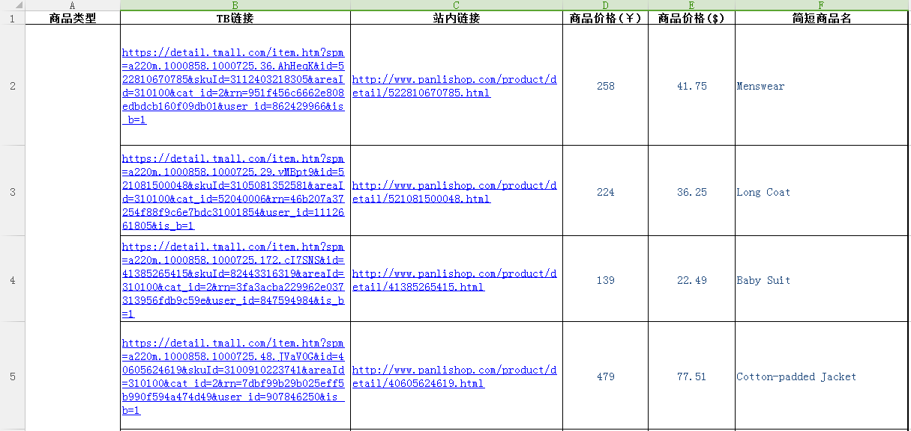

xlsx2json
=========
[English Document](./docs/doc_en.md)

### 作用
让excel表达复杂的json格式,将xlsx文件转成json。

### 感谢
某些想法也是借鉴了一个clojure的excel转json的开源项目 [excel-to-json ](https://github.com/mhaemmerle/excel-to-json)。

### 使用说明
目前只支持.xlsx格式，不支持.xls格式。

首先设置好node环境变量。

配置config.json

```json
{
    "xlsx": {
        "head": 1,// 表头所在的行
        "src": "./excel/**/[^~$]*.xlsx", // xlsx文件 glob配置风格
        "dest": "./json",    // 导出的json存放的位置
        "arraySeparator":"," // 数组的分隔符
    }
}
```

### 注：
* 查看帮助：执行`node index.js -h` 查看使用帮助；
* excel导出json：
	* windows: 双击`export.bat` 即可将 `./excel/*.xlsx` 文件导出到 `./json` 下。
	* mac: 运行`./export.sh` 即可将 `./excel/*.xlsx` 文件导出到 `./json` 下。
* 还支持命令行传参导入导出特定excel，具体使用 node `index.js --help` 查看。

#### 示例1 test.xlsx


输出如下：

```json
[
  {
    "商品类型": null,
    "TB链接": "https://detail.tmall.com/item.htm?spm=a220m.1000858.1000725.36.AhHeqK&id=522810670785&skuId=3112403218305&areaId=310100&cat_id=2&rn=951f456c6662e808edbdcb160f09db01&user_id=862429966&is_b=1",
    "站内链接": "http://www.panlishop.com/product/detail/522810670785.html",
    "商品价格(￥)": 258,
    "商品价格($)": 41.75,
    "简短商品名": "Menswear"
  },
  {
    "商品类型": null,
    "TB链接": "https://detail.tmall.com/item.htm?spm=a220m.1000858.1000725.29.vMBpt9&id=521081500048&skuId=3105081352581&areaId=310100&cat_id=52040006&rn=46b207a37254f88f9c6e7bdc31001854&user_id=1112661805&is_b=1",
    "站内链接": "http://www.panlishop.com/product/detail/521081500048.html",
    "商品价格(￥)": 224,
    "商品价格($)": 36.25,
    "简短商品名": "Long Coat"
  },
  {
    "商品类型": null,
    "TB链接": "https://detail.tmall.com/item.htm?spm=a220m.1000858.1000725.172.cI7SNS&id=41385265415&skuId=82443316319&areaId=310100&cat_id=2&rn=3fa3acba229962e037313956fdb9c59e&user_id=847594984&is_b=1",
    "站内链接": "http://www.panlishop.com/product/detail/41385265415.html",
    "商品价格(￥)": 139,
    "商品价格($)": 22.49,
    "简短商品名": "Baby Suit"
  },
  {
    "商品类型": null,
    "TB链接": "https://detail.tmall.com/item.htm?spm=a220m.1000858.1000725.48.JVaV0G&id=40605624619&skuId=3100910223741&areaId=310100&cat_id=2&rn=7dbf99b29b025eff5b990f594a474d49&user_id=907846250&is_b=1",
    "站内链接": "http://www.panlishop.com/product/detail/40605624619.html",
    "商品价格(￥)": 479,
    "商品价格($)": 77.51,
    "简短商品名": "Cotton-padded Jacket"
  },
  {
    "商品类型": null,
    "TB链接": "https://detail.tmall.com/item.htm?spm=a220m.1000858.1000725.11.mZu8kp&id=43552093326&skuId=3115115506203&areaId=310100&cat_id=2&rn=206406eabffb4bea5c640d14401c3584&user_id=480140223&is_b=1",
    "站内链接": "http://www.panlishop.com/product/detail/43552093326.html",
    "商品价格(￥)": 1189,
    "商品价格($)": 192.39,
    "简短商品名": "Cotton-padded Jacket"
  },
  {
    "商品类型": null,
    "TB链接": "https://detail.tmall.com/item.htm?spm=a220m.1000858.1000725.93.mZu8kp&id=523029571163&skuId=3113911684107&areaId=310100&cat_id=2&rn=206406eabffb4bea5c640d14401c3584&user_id=1680275838&is_b=1",
    "站内链接": "http://www.panlishop.com/product/detail/523029571163.html",
    "商品价格(￥)": 137,
    "商品价格($)": 22.17,
    "简短商品名": "Climb Clothes"
  },
  {
    "商品类型": null,
    "TB链接": "https://detail.tmall.com/item.htm?spm=a220m.1000858.1000725.87.m92yQw&id=41161920176&skuId=80823172912&areaId=310100&cat_id=2&rn=fd1967db3bdc4d849806503fe5b7b28b&user_id=1641088585&is_b=1",
    "站内链接": "http://www.panlishop.com/product/detail/41161920176.html",
    "商品价格(￥)": 268,
    "商品价格($)": 43.37,
    "简短商品名": "Cotton-padded Jacket"
  },
  {
    "商品类型": null,
    "TB链接": "https://detail.tmall.com/item.htm?spm=a220m.1000858.1000725.53.hELNbL&id=42670925770&skuId=3113299516655&areaId=310100&cat_id=50025135&rn=8e036c0c327648c40964bb699728efe6&user_id=1957662395&is_b=1",
    "站内链接": "http://www.panlishop.com/product/detail/42670925770.html",
    "商品价格(￥)": 198,
    "商品价格($)": 32.04,
    "简短商品名": "Sweater"
  },
  {
    "商品类型": null,
    "TB链接": "https://detail.tmall.com/item.htm?spm=a220m.1000858.1000725.226.kEGuJ4&id=521363425431&skuId=3116779591181&areaId=310100&cat_id=2&rn=3ce64218f06b963f9109545691c05565&user_id=468066543&is_b=1",
    "站内链接": "http://www.panlishop.com/product/detail/521363425431.html",
    "商品价格(￥)": 139,
    "商品价格($)": 22.49,
    "简短商品名": "Wide-legged Pants"
  },
  {
    "商品类型": null,
    "TB链接": "https://detail.tmall.com/item.htm?spm=a220m.1000858.1000725.307.flwuNN&id=42164926076&skuId=3119240645648&areaId=310100&cat_id=2&rn=3a43f8d9886c00d7203f2ccee45ef47a&user_id=765856261&is_b=1",
    "站内链接": "http://www.panlishop.com/product/detail/42164926076.html",
    "商品价格(￥)": 149,
    "商品价格($)": 24.11,
    "简短商品名": "Leather Pants"
  } 
]
```

## 支持以下数据类型
* number 数字类型
* boolean  布尔
* string 字符串
* date 日期类型
* object 对象  // 不支持对象内有数组以及对象嵌套对象，防止表格过度复杂。
* number-array  数字数组
* boolean-array  布尔数组
* string-array  字符串数组
* object-array 对象数组

## 表头规则
* 基本数据类型(string,number,bool)时候，一般不需要设置会自动判断，但是也可以明确声明数据类型。
* 字符串类型：此列表头的命名形式 `列名#string` 。
* 数字类型：此列表头的命名形式 `列名#number` 。
* 日期类型：`列名#date` 。格式`YYYY/M/D H:m:s` or `YYYY/M/D` or `YYYY-M-D H:m:s` or `YYYY-M-D`。（注意：目前xlsx文件里面列必须设置为文本类型，如果是日期类型的话，会导致底层插件解析出来错误格式的时间）.
* 布尔类型：此列表头的命名形式 `列名#bool` 。
* 基本类型数组：此列表头的命名形式 `列名#[]` 。
* 对象：此列表头的命名形式 `列名#{}` 。
* 对象数组：此列表头的命名形式`列名#[{}]` 。


## 数据规则
* 关键符号都是半角符号。
* 数组使用逗号`,`分割。
* 对象属性使用分号`;`分割。
* 列格式如果是日期，导出来的是格林尼治时间不是当时时区的时间，列设置成字符串可解决此问题。

## 原理说明
* 依赖 `node-xlsx` 这个项目解析xlsx文件。
* xlsx就是个zip文件，解压出来都是xml。有一个xml存的string，有相应个xml存的sheet。通过解析xml解析出excel数据(json格式)，这个就是`node-xlsx` 做的工作。
* 本项目只需利用 `node-xlsx` 解析xlsx文件，然后拼装自己的json数据格式。
